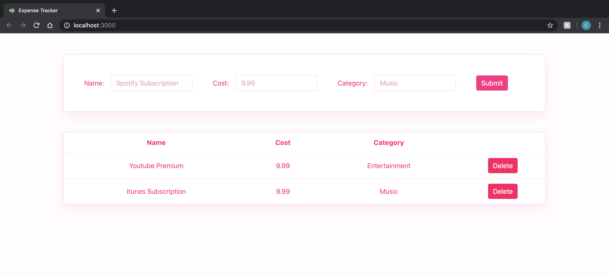

# :money_with_wings: Expense Tracker
An expense tracker that lets users record and manage expenses.
Note that only the UI portion is implemented here, so no data is persisted.
***

## Running the Code
#### 1. Install Node and npm if you don't already have it (https://nodejs.org/en/)

#### 2. Clone this repo:
```
git clone https://github.com/cindyou11/expense-tracker.git
```

#### 3. Install dependencies by running `npm install`

#### 4. Start the app by running `npm start`. This will automatically open a browser window to the application at http://localhost:3000/.
